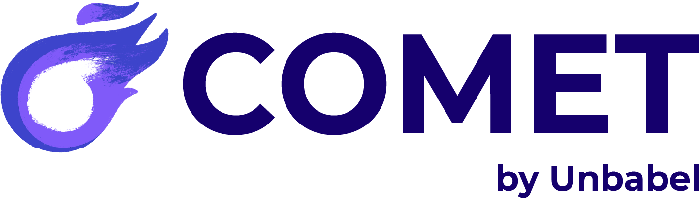

COMET: High-quality Machine Translation Evaluation
===================================================

What is COMET
==============

COMET is an open-source framework for MT evaluation that can be used for two purposes:

* To evaluate MT systems with our currently available high-performing metrics (check: :ref:`models:COMET Metrics`).
* To train and develop new metrics.

Contents:
=========

.. toctree::
   :maxdepth: 2

   installation
   running
   models
   training

License
==============

Free software: Apache License 2.0

Citation
=========

If you use COMET to evaluate your MT system or to develop new metrics please cite the following paper:
`COMET: A Neural Framework for MT Evaluation <https://arxiv.org/abs/2009.09025>`_

Library Reference
==================

.. toctree::
   :maxdepth: 2

   library
