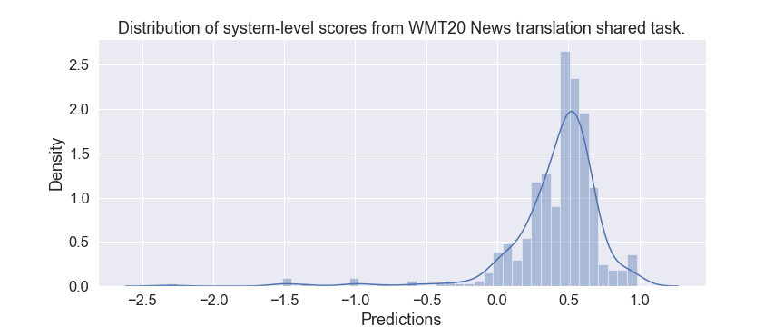

# COMET Metrics

COMET models can be optimized towards different kinds of human judgements (for example HTER or DA). Accordingly we list below the available metric models. Note that the recommmended standard metric is highlighted at the top of the table:

| Model              |               Description                        |
| :--------------------- | :------------------------------------------------ |
| ↑`wmt-large-da-estimator-1719` | **recommended:** Estimator model build on top of XLM-R (large) trained on DA from WMT17, WMT18 and WMT19 |
| ↑`wmt-base-da-estimator-1719` | Estimator model build on top of XLM-R (base) trained on DA from WMT17, WMT18 and WMT19 |
| ↑`wmt-large-qe-estimator-1719` | **Reference-less Estimator** model build on top of XLM-R (large) trained on DA from WMT17, WMT18 and WMT19 |
| ↓`wmt-large-hter-estimator` | Estimator model build on top of XLM-R (large) trained to regress on HTER. |
| ↓`wmt-base-hter-estimator` | Estimator model build on top of XLM-R (base) trained to regress on HTER. |
| ↑`emnlp-base-da-ranker`    | Translation ranking model that uses XLM-R to encode sentences. This model was trained with WMT17 and WMT18 Direct Assessments Relative Ranks (DARR). |

All the models starting with the `wmt-*` prefix were trained for the WMT2020 shared task, thus they were only introduced in our submission to the [shared task](http://www.statmt.org/wmt20/pdf/2020.wmt-1.101.pdf). The `emnlp-base-da-ranker` was introduced in the [COMET framework paper](https://www.aclweb.org/anthology/2020.emnlp-main.213.pdf) and used as a baseline in WMT20 Metrics shared task.

**NOTE:** Even when regressing on the same types of human judgement, scores between metrics are not comparable (e.g. scores from a large and a base model are not comparable even when trained on the same type of judgements)! Please make sure you use the same metric when comparing two systems!

Also, since HTER measures the amount of edits we needed to correct an MT hypothesis, output scores will be inverted, i.e. lower scores mean higher quality (indicated with ↓ in the table above).

Finally, we also provide a list of DA estimator models trained only with data from 2017 and 2018.

| Model              |               Description                        |
| :--------------------- | :------------------------------------------------ |
| ↑`wmt-large-da-estimator-1718` | Same as `wmt-large-da-estimator-1719` but only trained with data from WMT17 and WMT18. |
| ↑`wmt-base-da-estimator-1718` | Same as `wmt-base-da-estimator-1719` but only trained with data from WMT17 and WMT18. |

## FAQ

### What model/metric should I use?

The standard metric model loaded as default is the `wmt-large-da-estimator-1719` and this is the model we hope to promote as the 'standard' COMET metric.

### How to interpret COMET predicted scores?

COMET models like our **recommended model (`wmt-large-da-estimator-1719`)** were trained to simulate the ratings of the [WMT Metrics shared task](http://www.statmt.org/wmt20/metrics-task.html), which are normalized per annotator. This means that predicted scores are not bounded between 0 and 1 (like BLEU or METEOR). To help you analyse your scores we took all the scores from all systems submitted to the [WMT20 News Translation shared task](http://www.statmt.org/wmt20/translation-task.html):

<p align="center">
    
</p>

Here are a few stats:
- The median system score is 0.415992
- Systems with score < 0.313875 are in the bottom 25%
- Systems with score > 0.582837 are in the top 25%

Models trained on [HTER](http://www.mt-archive.info/05/AMTA-2006-Snover.pdf) are easier to interpret due to the fact that HTER is bounded at 0. For all HTER models achieving a value close to 0 would mean that your MT system produces translations that do not require post-editions in order to be "correct". Regardless of that take into consideration that the median system score with our HTER model (`wmt-large-hter-estimator`) is 0.125638 for all the systems submitted to the [WMT20 News Translation shared task](http://www.statmt.org/wmt20/translation-task.html) and a system must achieve a score lower than 0.070397 to be in the top 25%.

Translation Ranking models (e.g. `emnlp-base-da-ranker`) are based on distances and the result for a single segment should tell you: "How close, semantically, is that translation from the source and the reference texts". With that said, the median system score for the WMT20 data is 0.172957, systems with a score <0.151348 are in the bottom 25% and systems with a score >0.192181 are in the top 25%.  

### How to obtain a corpus-level score?

When using the python `predict` function we obtain a list of segment-level scores. The corpus-level score is an arithmetic mean between the segment-level scores.

```python
_, sgm_scores = model.predict(data, cuda=True, show_progress=False)
corpus_score = sum(sgm_scores)/len(sgm_scores)

```